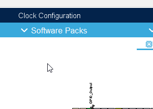

# Add ThreadX to CubeMX project

## Software Pack
In CubeMX Tab:

1. Software packs
2. Select components

1. Open X-Cube-Azure-H7
2. Open RTOS
   1. Select ThreadX / Core
   2. Select ThreadX / PerformanceInfo
   3. Select ThreadX / TraceX support
4. Open Device (only in version 1.x.x)
   1. Select HW_Profile: STM32H723ZG_NUCLEO
   2. Select Application: azure_rtos_app    
5. Click OK

## Configure ThreadX mode

1. Select software packs
2. Select X-Cube-Azure-H7
3. In mode
   1. Check Device AZURE RTOS Applications
   2. RTOS ThreadX
4. Save project CTRL+S (this will generate ThreadX files to our project)

