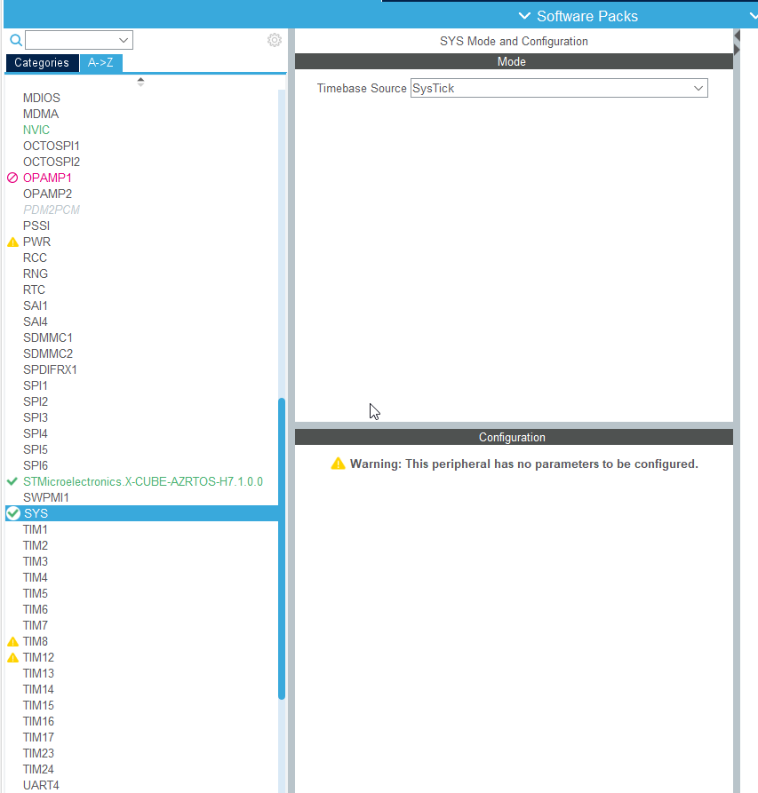
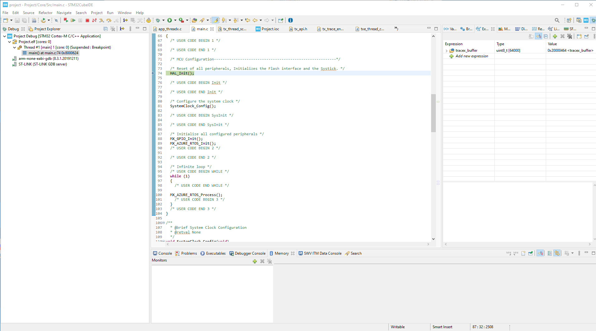
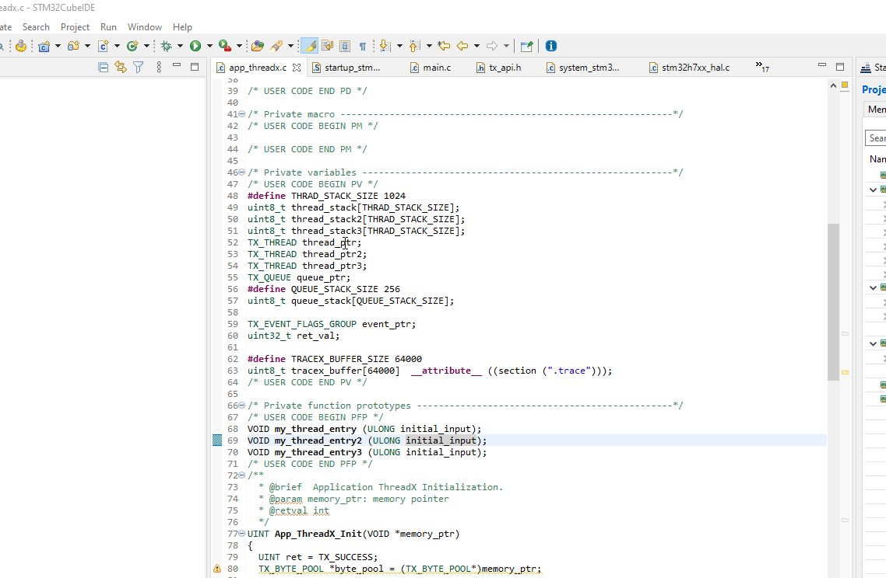
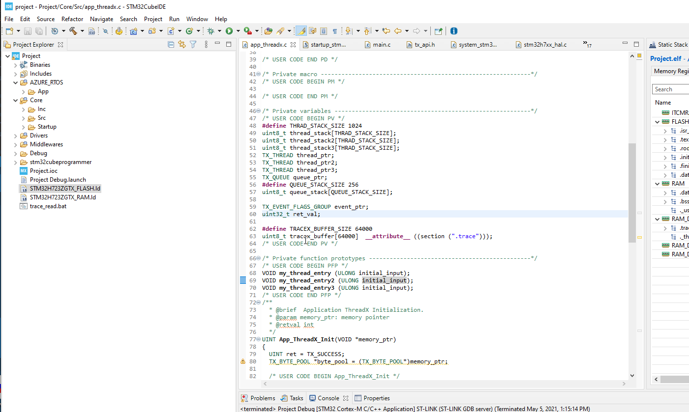
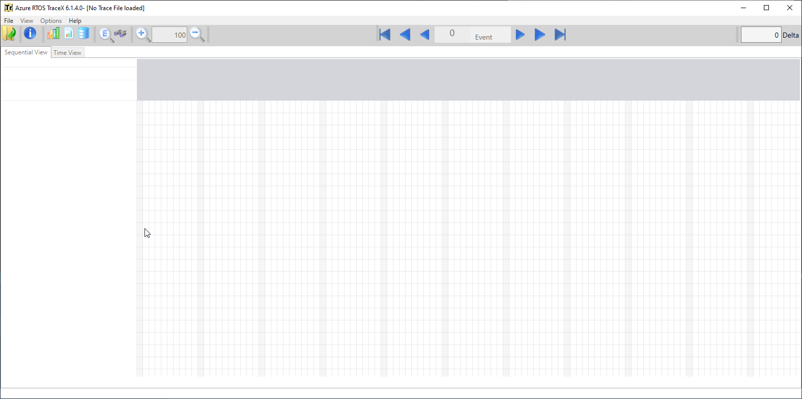
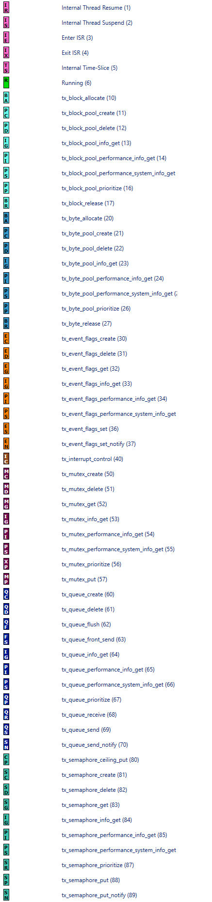

# How to add TraceX support to our ptoject

## Add TraceX in CubeMX

Add TraceX in pack

Enable trace feature in Configuration
Go to X-Cube-AZRTOS-H7.1.0.0 periphery
In configuration search for TX_ENABLE_EVENT_TRACE and set it to ENABLE



## Add TraceX support in code

First we need to create buffer inside STM32 for TraceX data.
In file app_hreadx.c
We add:

```c
#define TRACEX_BUFFER_SIZE 64000
uint8_t tracex_buffer[64000];
```

Into function `App_ThreadX_Init`
We enable the trace

```c
tx_trace_enable(&tracex_buffer,TRACEX_BUFFER_SIZE,30);
```

## Storing trace

1. Run you code in CubeIDE
2. Suspend your code
3. Open memory window
4. Add there `&tracex_buffer` variable
5. Export
6. Select ranges and file location and RAW file type
7. Export



## Automatic read form STM32

This change will allow to read the conent of trace buffer by batchfile.
First must change the debug configuration to Shared ST-Link

1. Menu>Run>Debug Configurations ..
2. Select debug configuration
3. Tab Debugger
4. Check shared ST-Link



This option allow to use ST-Link by CubeIDE for debugging and in same time CubeProgrammer can read trace buffer content.

Now we need to place trace buffer on fix location that it will be easy to find it. Best is to place it to memory `RAM_D1` at address 0x24000000
For this we must add to linker file `STM32H723ZGTX_FLASH.ld` this lines:

```c
 .trace :
 {
  . = ALIGN(4);
 	*(.trace)
 } > RAM_D1
```

It will create in linker section `.trace` which will be in `RAM_D1`



And last change in out project is to assign the tracex_buffer to `.trace` section.

```c
uint8_t tracex_buffer[64000]  __attribute__ ((section (".trace")));
```

The ` __attribute__ ((section (".trace")))` is section assign to `tracex_buffer` variable.

Create bat file in my case `trace_read.bat` and put it to same place as projcet \*.IOC file

```bash
.\stm32cubeprogrammer\bin\STM32_Programmer_CLI.exe -c port=SWD mode=HOTPLUG shared -u 0x24000000 64000 .\Debug\tracex.bin
copy .\Debug\tracex.bin .\Debug\tracex.trx
```

I put the stm32cube programmer to same folder as my project for this reason i have path

```
.\stm32cubeprogrammer\bin\STM32_Programmer_CLI.exe
```

But you can change it to your STM32CubeProgrammer place by default

```
c:\Program Files\STMicroelectronics\STM32Cube\STM32CubeProgrammer\bin\STM32_Programmer_CLI.exe
```

The part is set SWD connection. No reset with `HOTPLUG` and ST-Link is `shared`

```
-c port=SWD mode=HOTPLUG shared
```

This will read address `0x24000000` and `64000` bytes and store it to file `.\Debug\tracex.bin `

```
-u 0x24000000 64000 .\Debug\tracex.bin
```

## Open trace in TraceX

Now we simply open the file with TraceX



### ThreadX Legend




