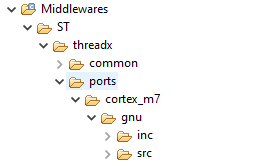
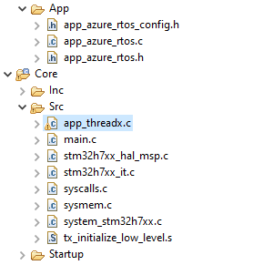

# ThreadX basic

ThreadX is added by CubeMX to project on place

The main acces point to Thread is is include for `tx_api.h`

```c
#include "tx_api.h"
```

ThreadX is added by CubeMX to Middleware section



CubeMX generated files are in AZURE_RTOS and Core/Src



Main file for user to handle is app_threadx.c where is need to create ThreadX items like tasks, queues, memory pools, ...

## Program start flow

ThreadX is called from main.c over `MX_AZURE_RTOS_Init` function. Inside is called `tx_kernel_enter` which will initialize ThreadX and start it.
Before ThreadX is started. The `tx_application_define` is called where used can allocate his memory, create taskts and other itesms from ThreadX. After this function ends ThreadX is started.


