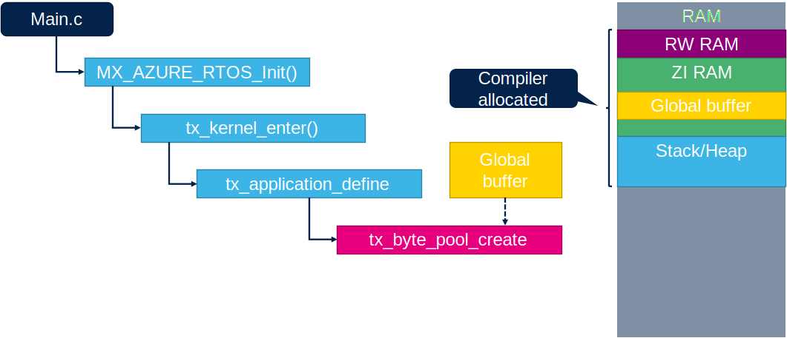
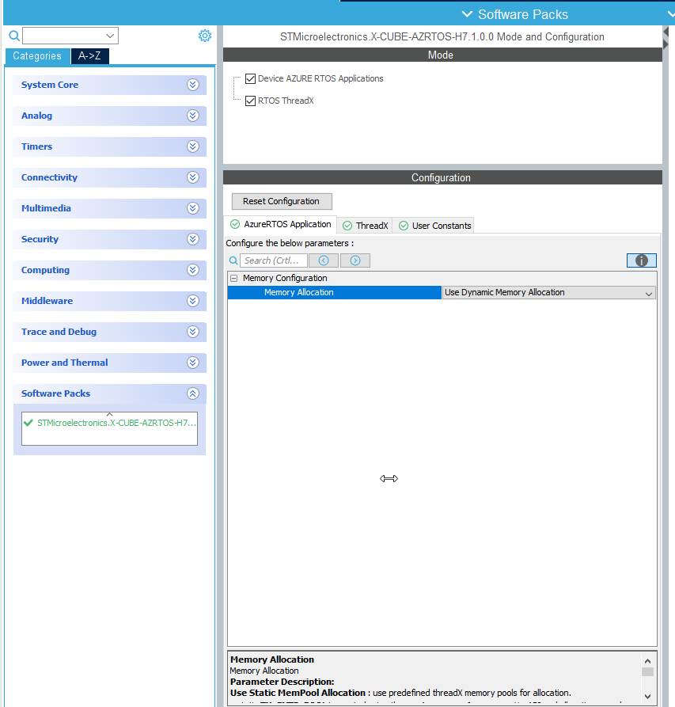

# ThreadX memory allocations

ThreadX support two basic aproaches how to manage memory allocation:

1. Static allocation
2. Dynamic allocation

## Static memory allocation

In CubeMX generated ThreadX files the static memory alloication is created in function
`tx_application_define`
in this function use created buffer `tx_byte_pool_buffer` based on user stack size `TX_APP_MEM_POOL_SIZE`
Function create new byte pool `tx_app_byte_pool` with `tx_byte_pool_create` and call `App_ThreadX_Init` with `tx_app_byte_pool` as argument. There the buffer can be used for allocation. Or user can use own buffers.



### Select static memory allocation



In generated code in app_azure_rtos.c

```c
    static UCHAR tx_byte_pool_buffer[TX_APP_MEM_POOL_SIZE];  /*!This is used as pool source!*/
    static TX_BYTE_POOL tx_app_byte_pool;

    /**
    * @brief  Define the initial system.
    * @param  first_unused_memory : Pointer to the first unused memory
    * @retval None
    */
    VOID tx_application_define(VOID *first_unused_memory)
    {
        /* USER CODE BEGIN  tx_application_define_1*/

        /* USER CODE END  tx_application_define_1 */
    #if (USE_MEMORY_POOL_ALLOCATION == 1)
    VOID *memory_ptr;

    if (tx_byte_pool_create(&tx_app_byte_pool, "Tx App memory pool", tx_byte_pool_buffer, TX_APP_MEM_POOL_SIZE) != TX_SUCCESS)
    {
        /* USER CODE BEGIN TX_Byte_Pool_Error */

        /* USER CODE END TX_Byte_Pool_Error */
    }
    else
    {
        /* USER CODE BEGIN TX_Byte_Pool_Success */

        /* USER CODE END TX_Byte_Pool_Success */

        memory_ptr = (VOID *)&tx_app_byte_pool;

        if (App_ThreadX_Init(memory_ptr) != TX_SUCCESS)
        {
            /* USER CODE BEGIN  App_ThreadX_Init_Error */

            /* USER CODE END  App_ThreadX_Init_Error */
        }
        /* USER CODE BEGIN  App_ThreadX_Init_Success */

        /* USER CODE END  App_ThreadX_Init_Success */

    }
    }

```

## Dynamic meory allocation

In dynamic allocation the approach is different.
The buffer is providem from `tx_application_define` function argument `first_unused_memory`. Here the user can use this buffer to create his own byte pool and manage with it his memory.
The `first_unused_memory` is provided directly by ThreadX. Based on CubeMX implementation. Here is necessary to add this allocation to linker file.
To STM32H723GTX_FLASH.ld is added this code:

```c
  ._threadx_heap :
  {
    . = ALIGN(8);
    __RAM_segment_used_end__ = .;
    . = . + 64K;
    . = ALIGN(8);
  } >RAM_D1 AT> RAM_D1

```

Code must be put before `._user_heap_stack` section in linker.


### Select dynamic memory allocation


In generated code in app_azure_rtos.c

```c
/**
  * @brief  Define the initial system.
  * @param  first_unused_memory : Pointer to the first unused memory
  * @retval None
  */
VOID tx_application_define(VOID *first_unused_memory)
{
    /* USER CODE BEGIN  tx_application_define_1*/

    /* USER CODE END  tx_application_define_1 */

  /* USER CODE BEGIN DYNAMIC_MEM_ALLOC */
  (void)first_unused_memory;               /*!This is used as pool source!*/
  /* USER CODE END DYNAMIC_MEM_ALLOC */
#endif

}
```
