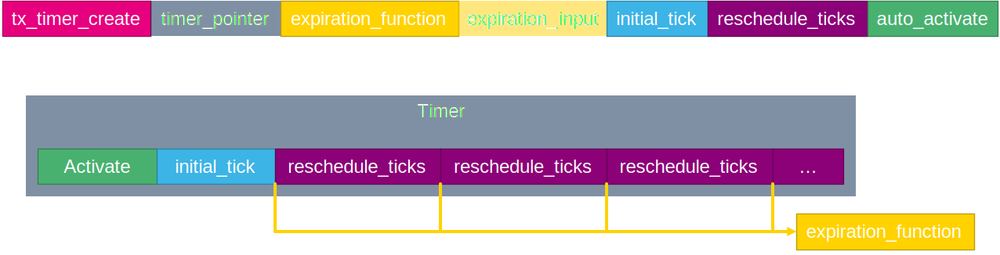
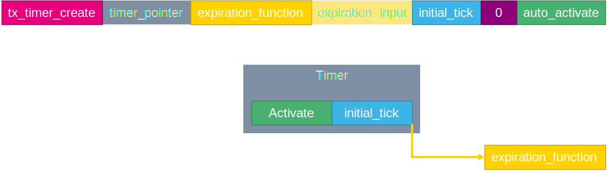
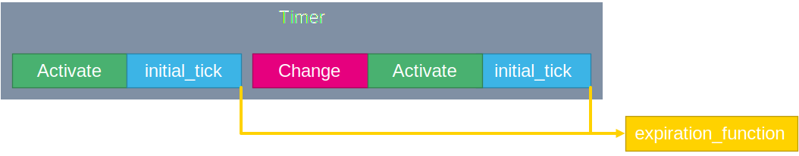

# Timer

Timer can be used to create delay between operations. Or to simply measure time.

# Timer create

To create a timer we will used function `tx_timer_create`.
First function argum,ent is pointer to timer handle `timer_ptr`.
Second argument is name of timer `my_timer`.
Third argument is function which will be called when timer expires `my_timer_expire`.
Forth argument is input value for expire function `0x12`.
Fifth argument is initial tick value `100`. It is time between first activation and timer expire
Sisth argument is reschedule tick value `200`. This value is used periodicaly after first initiali tick expire. If 0 timer is in One shot mode.
Seventh argument is timer autostart. It can be set to `TX_NO_ACTIVATE` or `TX_ACTIVATE`.

```c
/*timer handle*/
TX_TIMER timer_ptr;


ret_val = tx_timer_create(&timer_ptr,"my_timer",my_timer_expire,0x12,100,200,TX_ACTIVATE);

/*expire function*/
VOID my_timer_expire(ULONG input_value){
	HAL_GPIO_TogglePin(GPIOB, GPIO_PIN_0);
}
```

# Timer use

To use timer in repetitive mode we set repetition value to value between 0x1 to 0xFFFFFFFF. Then when timer is activated we get first initial tick delay and then periodic repetitive delays.



If is used `TX_ACTIVATE` timer is started by `tx_timer_create`. If `TX_NO_ACTIVATE` is used we must start timer with `tx_timer_activate`.

Example of reperitive timer

```c
/* USER CODE BEGIN PV */
#define THRAD_STACK_SIZE 1024
uint8_t thread_stack[THRAD_STACK_SIZE];
TX_THREAD thread_ptr;
uint32_t ret_val;
TX_TIMER timer_ptr;

/* USER CODE END PV */

/* Private function prototypes -----------------------------------------------*/
/* USER CODE BEGIN PFP */
VOID my_thread_entry (ULONG initial_input);
VOID my_timer_expire(ULONG input_value);
/* USER CODE END PFP */
/**
  * @brief  Application ThreadX Initialization.
  * @param memory_ptr: memory pointer
  * @retval int
  */
UINT App_ThreadX_Init(VOID *memory_ptr)
{
  UINT ret = TX_SUCCESS;
  TX_BYTE_POOL *byte_pool = (TX_BYTE_POOL*)memory_ptr;

  /* USER CODE BEGIN App_ThreadX_Init */
  ret_val = tx_thread_create(&thread_ptr, "my_thread",
      my_thread_entry, 0x1234,
	  thread_stack, THRAD_STACK_SIZE,
      14, 14, 1,
      TX_AUTO_START);

  ret_val = tx_timer_create(&timer_ptr,"my_timer",my_timer_expire,0x12,100,200,TX_ACTIVATE);

  /* USER CODE END App_ThreadX_Init */

  return ret;
}

/* USER CODE BEGIN 1 */
VOID my_timer_expire(ULONG input_value){
	HAL_GPIO_TogglePin(GPIOB, GPIO_PIN_0);
}

VOID my_thread_entry (ULONG initial_input)
{
	while(1){
		HAL_GPIO_TogglePin(GPIOE, GPIO_PIN_1);
		tx_thread_sleep(400);
	}
}

```

# One shot timer

One shot timer is used when repetitive argument is 0.



Then the timer runs only once. To restart timer we must first call `tx_timer_change` and then `tx_timer_activate`.



```c
/* USER CODE BEGIN PV */
#define THRAD_STACK_SIZE 1024
uint8_t thread_stack[THRAD_STACK_SIZE];
TX_THREAD thread_ptr;

uint32_t ret_val;
TX_TIMER timer_ptr;

/* USER CODE END PV */

/* Private function prototypes -----------------------------------------------*/
/* USER CODE BEGIN PFP */
VOID my_thread_entry (ULONG initial_input);
VOID my_timer_expire(ULONG input_value);
/* USER CODE END PFP */
/**
  * @brief  Application ThreadX Initialization.
  * @param memory_ptr: memory pointer
  * @retval int
  */
UINT App_ThreadX_Init(VOID *memory_ptr)
{
  UINT ret = TX_SUCCESS;
  TX_BYTE_POOL *byte_pool = (TX_BYTE_POOL*)memory_ptr;

  /* USER CODE BEGIN App_ThreadX_Init */
  ret_val = tx_thread_create(&thread_ptr, "my_thread",
      my_thread_entry, 0x1234,
	  thread_stack, THRAD_STACK_SIZE,
      14, 14, 1,
      TX_AUTO_START);

  ret_val = tx_timer_create(&timer_ptr,"my_timer",my_timer_expire,0x12,100,0,TX_NO_ACTIVATE);

  /* USER CODE END App_ThreadX_Init */

  return ret;
}

/* USER CODE BEGIN 1 */
VOID my_timer_expire(ULONG input_value){
	HAL_GPIO_TogglePin(GPIOB, GPIO_PIN_0);
}

VOID my_thread_entry (ULONG initial_input)
{
	while(1){
		HAL_GPIO_TogglePin(GPIOE, GPIO_PIN_1);
		tx_timer_change(&timer_ptr,100,0);
		tx_timer_activate(&timer_ptr);
		tx_thread_sleep(400);
	}
}


```
