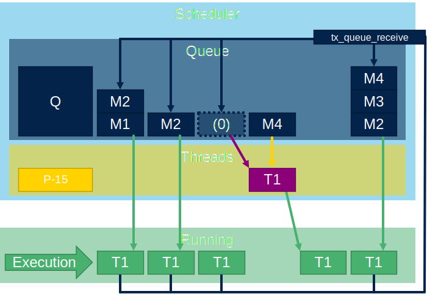
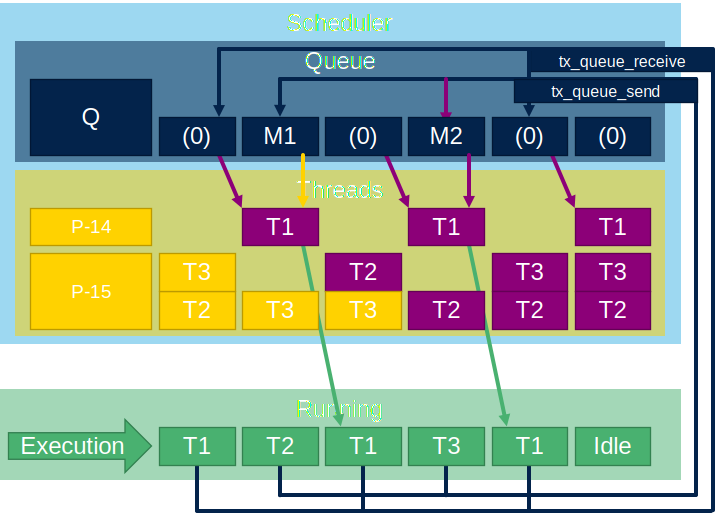

# Messageq queue

The queue again is very simalar to semaphore. But here the thread is possible to put and get from queue also coneten. So queue is used mainly to echange data between threads.

## Message queue create

To create queue we will use `tx_queue_create`.
First argument is queue handle `queue_ptr`.
Second argument is name os queue `my_queue`.
Third argument is queue message size 1-16words. In out case `1`.
Forth argument is queue buffer `queue_stack`.
Fifth argument is queue buffer size in bytes `256`.

```c
TX_QUEUE queue_ptr;
#define QUEUE_STACK_SIZE 256
uint8_t queue_stack[QUEUE_STACK_SIZE];


 ret_val=tx_queue_create(&queue_ptr,"my_queue",1,queue_stack,256);
```


### Message queue send

To add message to queue we use function `tx_queue_send`.
First argument is queue handle `queue_ptr`.
Second argument is pointer to messagge `message`.
Third argument is waiting time TX_NO_WAIT (0x0) to TX_WAIT_FOREVER(0xFFFFFFFF).

```c
VOID my_thread_entry3 (ULONG initial_input)
{

	while(1){
		uint32_t message=1;
		tx_thread_sleep(100);
		tx_queue_send(&queue_ptr,&message,TX_NO_WAIT);
	}
}
```


### Message queue receive

To remove message from queue we use function `tx_queue_receive`
First argument is queue handle `queue_ptr`.
Second argument is pointer to messagge `message`.
Third argument is waiting time TX_NO_WAIT (0x0) to TX_WAIT_FOREVER(0xFFFFFFFF).

```c
VOID my_thread_entry (ULONG initial_input)
{
	while(1){
		uint32_t message;
		ret_val=tx_queue_receive(&queue_ptr,&message,TX_WAIT_FOREVER);
		if(message){
			HAL_GPIO_TogglePin(GPIOB, GPIO_PIN_0);
		}else{
			HAL_GPIO_TogglePin(GPIOE, GPIO_PIN_1);
		}
	}
}
```



## Queue usage example

We will create one thread which will receive messages from queue and based on message it will set GREEN or YELLOW led.
Also we will create two threads which will send messages to this queue to toggle with GREEN or YELLO led.


What is application flow:



Main code:

```c
/* USER CODE BEGIN PV */
#define THRAD_STACK_SIZE 1024
uint8_t thread_stack[THRAD_STACK_SIZE];
uint8_t thread_stack2[THRAD_STACK_SIZE];
uint8_t thread_stack3[THRAD_STACK_SIZE];
TX_THREAD thread_ptr;
TX_THREAD thread_ptr2;
TX_THREAD thread_ptr3;
TX_QUEUE queue_ptr;
#define QUEUE_STACK_SIZE 256
uint8_t queue_stack[QUEUE_STACK_SIZE];
uint32_t ret_val;

/* USER CODE END PV */

/* Private function prototypes -----------------------------------------------*/
/* USER CODE BEGIN PFP */
VOID my_thread_entry (ULONG initial_input);
VOID my_thread_entry2 (ULONG initial_input);
VOID my_thread_entry3 (ULONG initial_input);
/* USER CODE END PFP */
/**
  * @brief  Application ThreadX Initialization.
  * @param memory_ptr: memory pointer
  * @retval int
  */
UINT App_ThreadX_Init(VOID *memory_ptr)
{
  UINT ret = TX_SUCCESS;
  TX_BYTE_POOL *byte_pool = (TX_BYTE_POOL*)memory_ptr;

  /* USER CODE BEGIN App_ThreadX_Init */
  ret_val = tx_thread_create(&thread_ptr, "my_thread",
      my_thread_entry, 0x1234,
	  thread_stack, THRAD_STACK_SIZE,
      14, 14, 1,
      TX_AUTO_START);
  ret_val = tx_thread_create(&thread_ptr2, "my_thread2",
      my_thread_entry2, 0x1234,
	  thread_stack2, THRAD_STACK_SIZE,
      15, 15, 1,
      TX_AUTO_START);
  ret_val = tx_thread_create(&thread_ptr3, "my_thread3",
      my_thread_entry3, 0x1234,
	  thread_stack3, THRAD_STACK_SIZE,
      15, 15, 1,
      TX_AUTO_START);
  ret_val=tx_queue_create(&queue_ptr,"my_queue",1,queue_stack,256);

  /* USER CODE END App_ThreadX_Init */

  return ret;
}

/* USER CODE BEGIN 1 */

VOID my_thread_entry (ULONG initial_input)
{
	while(1){
		uint32_t message;
		ret_val=tx_queue_receive(&queue_ptr,&message,TX_WAIT_FOREVER);
		if(message){
			HAL_GPIO_TogglePin(GPIOB, GPIO_PIN_0);
		}else{
			HAL_GPIO_TogglePin(GPIOE, GPIO_PIN_1);
		}
	}
}

VOID my_thread_entry2 (ULONG initial_input)
{
	while(1){
		uint32_t message=0;
		tx_thread_sleep(50);
		tx_queue_send(&queue_ptr,&message,TX_NO_WAIT);
	}
}
VOID my_thread_entry3 (ULONG initial_input)
{

	while(1){
		uint32_t message=1;
		tx_thread_sleep(100);
		tx_queue_send(&queue_ptr,&message,TX_NO_WAIT);
	}
}
```
