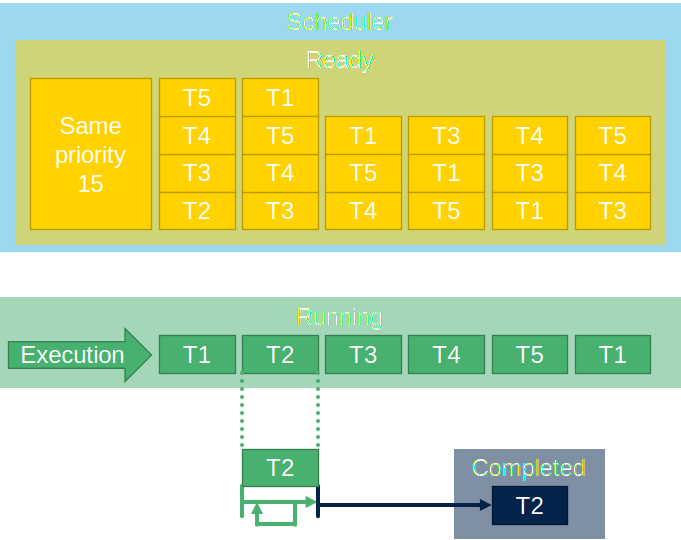
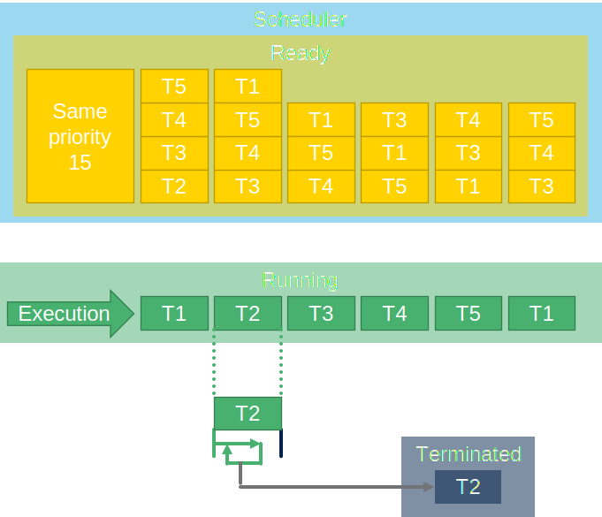
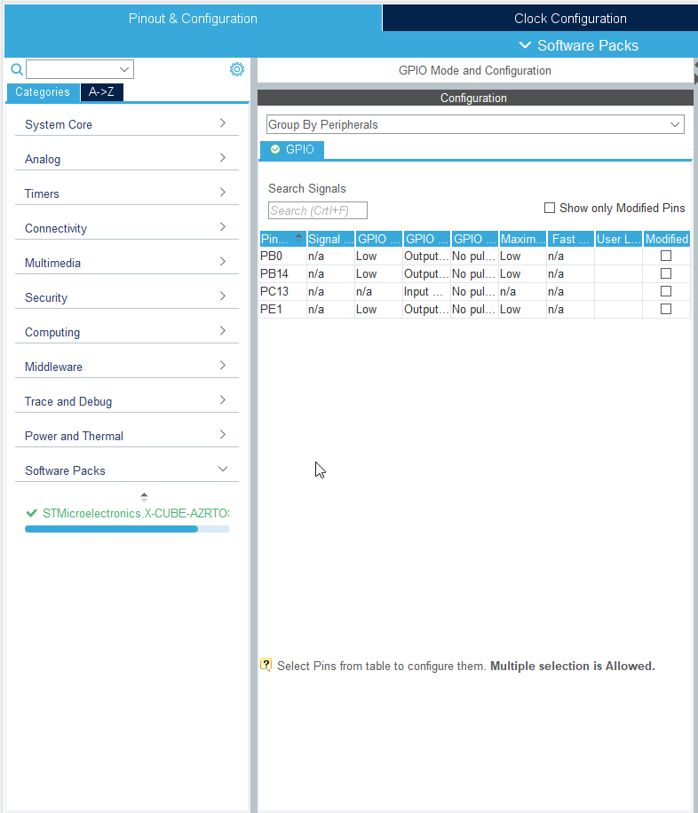
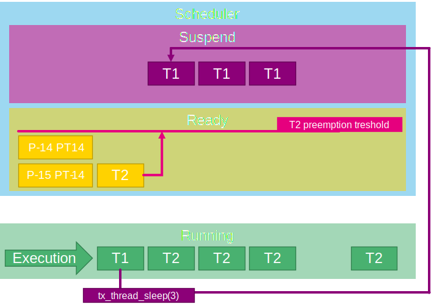
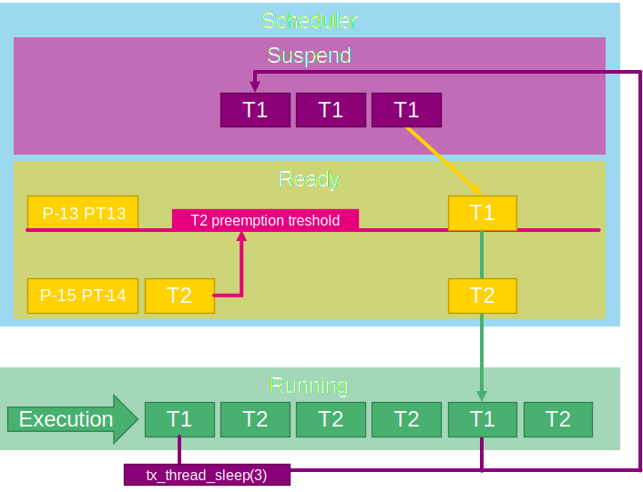

# Thread

In ThreadX thread is created by `tx_thread_create`:

```c
#define THREAD_STACK_SIZE 1024
uint8_t thread_stack[THRAD_STACK_SIZE];
TX_THREAD thread_ptr;
UINT App_ThreadX_Init(VOID *memory_ptr)
{
  UINT ret = TX_SUCCESS;
  TX_BYTE_POOL *byte_pool = (TX_BYTE_POOL*)memory_ptr;

  /* USER CODE BEGIN App_ThreadX_Init */
  ret_val = tx_thread_create(&thread_ptr, "my_thread",
      my_thread_entry, 0x1234,
	  thread_stack, THREAD_STACK_SIZE,
      15, 15, 1,
      TX_AUTO_START);
  /* USER CODE END App_ThreadX_Init */

  return ret;
}

VOID my_thread_entry (ULONG initial_input)
{
	while(1){
		HAL_GPIO_TogglePin(GPIOB, GPIO_PIN_0);
	}
}
```

First argument `thread_ptr` is pointer to thread structure defined as

```c
TX_THREAD thread_ptr;
```

Second argument is a name of thread. In our case "my_thread".
Third argument is a main thread function name. In this case `my_thread_entry` we must define this function in our application

```c
VOID my_thread_entry (ULONG initial_input)
{
	while(1){
		HAL_GPIO_TogglePin(GPIOB, GPIO_PIN_0);
	}
}
```

Forth argument is an input value for thread. If we put `0x1234` we will get this value in `initial_input` variable in `my_thread_entry` function.
Fifth and sixth argument is a stack array and size of this array.
Our stack is defined as

```c
uint8_t thread_stack[THREAD_STACK_SIZE];
```

and its' size is

```c
#define THREAD_STACK_SIZE 1024
```

Seventh argument is a thread priority. In our case 15.
Eight argument is a preemption theshold also set to 15.
Neinth argument is a thread slice count. In our case 1. This means that thread wll be active for one systick period. Before is used scheduler.
Tenth parameter is if thread will start as Ready(`TX_AUTO_START`) or Suspended(`TX_DONT_START`)

## Basic thread states


### Ready

Thread waiting to be executed. This is controlled by ThreadX scheduler.


### Executing(Running)

Thread is running for at least one RTOS tick.


### Suspend

Thread is stopped and waiting for semaphore or to be resumed.


We can put thread to suspend state by calling `tx_thread_suspend`.

### Completed

Thread finished and leaded function by return statement.



Thread finished by leaving its' main function.

```c
VOID my_thread_entry (ULONG initial_input)
{
	while(1){
		HAL_GPIO_TogglePin(GPIOB, GPIO_PIN_0);
	}
}/*<<<<leaving here finished the thread, or use return*/
```

### Terminated

Thread was ended by other threads or himself.



This can be done by calling `tx_thread_terminate`

```c
VOID my_thread_entry (ULONG initial_input)
{
	TX_THREAD* thread_pointer;
	while(1){
		HAL_GPIO_TogglePin(GPIOB, GPIO_PIN_0);
		thread_pointer=tx_thread_identify();
		tx_thread_terminate(thread_pointer);/*Thread terminate himself*/
	}
}
```

## Thread priority

The RTOS is executing thread with highest prority (lowest number) if this thread is in **ready** state.
In this case T1 (my_thread) is sleeping for 3 systicks interrupts. During this rime T2 (my_thread2) is executed. When T1 sleep expires it will preempt the T2, because T1 have higher priority.


```c
#define THREAD_STACK_SIZE 1024
uint8_t thread_stack[THREAD_STACK_SIZE];
uint8_t thread_stack2[THREAD_STACK_SIZE];
TX_THREAD thread_ptr;
TX_THREAD thread_ptr2;
uint32_t ret_val;

/* USER CODE END PV */

/* Private function prototypes -----------------------------------------------*/
/* USER CODE BEGIN PFP */
VOID my_thread_entry (ULONG initial_input);
VOID my_thread_entry2 (ULONG initial_input);
/* USER CODE END PFP */
/**
  * @brief  Application ThreadX Initialization.
  * @param memory_ptr: memory pointer
  * @retval int
  */
UINT App_ThreadX_Init(VOID *memory_ptr)
{
  UINT ret = TX_SUCCESS;
  TX_BYTE_POOL *byte_pool = (TX_BYTE_POOL*)memory_ptr;

  /* USER CODE BEGIN App_ThreadX_Init */
  ret_val = tx_thread_create(&thread_ptr, "my_thread",
      my_thread_entry, 0x1234,
	  thread_stack, THREAD_STACK_SIZE,
      14, 14, 1,
      TX_AUTO_START);
  ret_val = tx_thread_create(&thread_ptr2, "my_thread2",
      my_thread_entry2, 0x1234,
	  thread_stack2, THREAD_STACK_SIZE,
      15, 15, 1,
      TX_AUTO_START);

  /* USER CODE END App_ThreadX_Init */

  return ret;
}

/* USER CODE BEGIN 1 */


VOID my_thread_entry (ULONG initial_input)
{
	while(1){
		HAL_GPIO_TogglePin(GPIOB, GPIO_PIN_0);
		tx_thread_sleep(3);
	}
}

VOID my_thread_entry2 (ULONG initial_input)
{
	while(1){
		HAL_GPIO_TogglePin(GPIOE, GPIO_PIN_1);
	}
}

```

## Thread Preemption Threshold<sup>TM</sup>

Can be enabled in CubeMX by setting the `TX_DISABLE_PREEMPTION_TRESHOLD` to **disable**.



Preemption treshold will allow preempting of thread which is above this threshold.
Here is an example of the thread one T1 (`my_thread`) with priority 14 (P14) and second thread T2 (`my_thread2`) with priority 15 (P15) and preemption treshold PT14.
In this case the T1 cannot preempty T2, because T2 will allow preemption only for priority P13.



But if we change T1 priority to P13 then it is possible for T1 preempt T2.

```c
  ret_val = tx_thread_create(&thread_ptr, "my_thread",
      my_thread_entry, 0x1234,
	  thread_stack, THRAD_STACK_SIZE,
      13, 13, 1,
      TX_AUTO_START);
```



## Full code

```c
#define THRAD_STACK_SIZE 1024
uint8_t thread_stack[THRAD_STACK_SIZE];
uint8_t thread_stack2[THRAD_STACK_SIZE];
TX_THREAD thread_ptr;
TX_THREAD thread_ptr2;
uint32_t ret_val;
/* USER CODE END PV */

/* Private function prototypes -----------------------------------------------*/
/* USER CODE BEGIN PFP */
VOID my_thread_entry (ULONG initial_input);
VOID my_thread_entry2 (ULONG initial_input);
/* USER CODE END PFP */
/**
  * @brief  Application ThreadX Initialization.
  * @param memory_ptr: memory pointer
  * @retval int
  */
UINT App_ThreadX_Init(VOID *memory_ptr)
{
  UINT ret = TX_SUCCESS;
  TX_BYTE_POOL *byte_pool = (TX_BYTE_POOL*)memory_ptr;

  /* USER CODE BEGIN App_ThreadX_Init */
  ret_val = tx_thread_create(&thread_ptr, "my_thread",
      my_thread_entry, 0x1234,
	  thread_stack, THRAD_STACK_SIZE,
      14, 14, 1,
      TX_AUTO_START);
  ret_val = tx_thread_create(&thread_ptr2, "my_thread2",
      my_thread_entry2, 0x1234,
	  thread_stack2, THRAD_STACK_SIZE,
      15, 14, 1,
      TX_AUTO_START);
  /* USER CODE END App_ThreadX_Init */

  return ret;
}

/* USER CODE BEGIN 1 */


VOID my_thread_entry (ULONG initial_input)
{
	while(1){
		HAL_GPIO_TogglePin(GPIOB, GPIO_PIN_0);
		tx_thread_sleep(3);
	}
}

VOID my_thread_entry2 (ULONG initial_input)
{
	while(1){
		HAL_GPIO_TogglePin(GPIOE, GPIO_PIN_1);
	}
}
```
