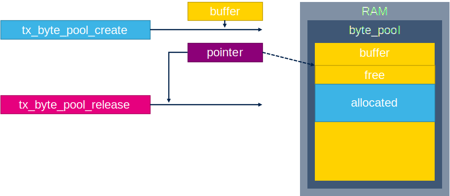
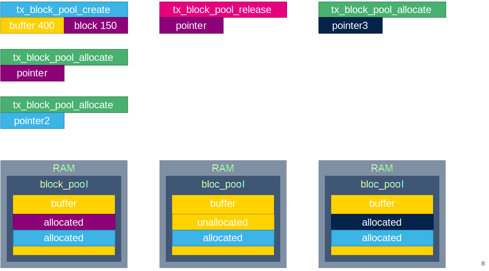

# ThreadX memory pools

For memory allocation in ThreadX is possible to use two aproaches.

1. Byte pool allocation
2. Block pool allocation

## Byte pool

For byte pool creation is used function `tx_byte_pool_create`
for this we need to create an array from which memory will be distributed and structure `TX_BYTE_POOL` to handle our byte pool informations.

```c
#define OUT_BYTE_ARRAY_LENGTH 400 //pout byte pool length
uint8_t out_byte_array[OUT_BYTE_ARRAY_LENGTH]; //our array for byte pool
TX_BYTE_POOL pool_ptr; //byte pool handle structure
```

Now we can create our first byte pool:

```c
tx_byte_pool_create(&pool_ptr,'our_byte_pool',out_byte_array,OUT_BYTE_ARRAY_LENGTH);
```

To get pool from out `pool_ptr` we must use `tx_byte_allocate` and prepare pointer which will hold information which memory part we get from byte pool.

```c
uint8_t* allocated_space_pointer;
```

And main memory allocation

```c
tx_byte_allocate(&pool_ptr,(VOID **)&allocated_space_pointer,128,TX_NO_WAIT );
```


To return the memory back we can use `tx_byte_release`

```c
tx_byte_release(allocated_space_pointer);
```



Be careful the `tx_byte_release` is trying to defragment data but it is not gurantee that if pool have enaugh bytes for pool they are next to each other
Like in this case:
Pool is 400byes.
We allocate wto byte pools.
Release first one.
And allocate new memory bigger than segments left in bytepool


Code for test:
Variables

```c
/* USER CODE BEGIN PV */
#define OUT_BYTE_ARRAY_LENGTH 400
uint8_t out_byte_array[OUT_BYTE_ARRAY_LENGTH];
TX_BYTE_POOL pool_ptr;
uint8_t* allocated_space_pointer;
uint8_t* allocated_space_pointer_2;
uint8_t* allocated_space_pointer_3;
uint32_t ret_val;
/* USER CODE END PV */
```

Functions

```c
UINT App_ThreadX_Init(VOID *memory_ptr)
{
  UINT ret = TX_SUCCESS;
  TX_BYTE_POOL *byte_pool = (TX_BYTE_POOL*)memory_ptr;

  /* USER CODE BEGIN App_ThreadX_Init */
  ret_val=tx_byte_pool_create(&pool_ptr,'our_byte_pool',out_byte_array,OUT_BYTE_ARRAY_LENGTH);

  ret_val=tx_byte_allocate(&pool_ptr,(VOID **)&allocated_space_pointer,128,TX_NO_WAIT );
  ret_val=tx_byte_allocate(&pool_ptr,(VOID **)&allocated_space_pointer_2,128,TX_NO_WAIT );
  ret_val=tx_byte_release(allocated_space_pointer);
  ret_val=tx_byte_allocate(&pool_ptr,(VOID **)&allocated_space_pointer_3,200,TX_NO_WAIT ); //this will fail

  /* USER CODE END App_ThreadX_Init */

  return ret;
}
```

## Block pool

The block pool is very similar to byte bool. Main difference is in allocation. When block size is fixed and used as parrameter for `tx_block_pool_create`. ThreadX will calculate how namy blocks as possible to create and each `tx_block_allocate` will take one block.

Our example we allocate one block pool with `tx_block_pool_create`.

```c
#define OUR_BLOCK_ARRAY_LENGTH 400
uint8_t out_byte_array[OUR_BLOCK_ARRAY_LENGTH];
TX_BLOCK_POOL pool_ptr;
ret_val = tx_block_pool_create(&pool_ptr,'block pool',150,out_byte_array,OUR_BLOCK_ARRAY_LENGTH);

```

and we get one block simple by calling `tx_block_allocate`

```c
ret_val=tx_block_allocate(&pool_ptr,(VOID **)&allocated_space_pointer,TX_NO_WAIT);
```


To release block is similar to byte pool. we will call `tx_block_release`.

```c
ret_val=tx_block_release(allocated_space_pointer);
```

The fragmentation issue is here not a problem because number of blocks is fixed and we can dirrectly check if block is available or not for this is possile to use `tx_block_pool_info_get` function.


Complete code:

```c
/* USER CODE BEGIN PV */
#define OUR_BLOCK_ARRAY_LENGTH 400
uint8_t out_byte_array[OUR_BLOCK_ARRAY_LENGTH];
TX_BLOCK_POOL pool_ptr;
uint8_t* allocated_space_pointer;
uint8_t* allocated_space_pointer_2;
uint8_t* allocated_space_pointer_3;
uint32_t ret_val;
/* USER CODE END PV */

/* Private function prototypes -----------------------------------------------*/
/* USER CODE BEGIN PFP */

/* USER CODE END PFP */
/**
  * @brief  Application ThreadX Initialization.
  * @param memory_ptr: memory pointer
  * @retval int
  */
UINT App_ThreadX_Init(VOID *memory_ptr)
{
  UINT ret = TX_SUCCESS;
  TX_BYTE_POOL *byte_pool = (TX_BYTE_POOL*)memory_ptr;

  /* USER CODE BEGIN App_ThreadX_Init */
  ret_val=tx_block_pool_create(&pool_ptr,'block pool',150,out_byte_array,OUR_BLOCK_ARRAY_LENGTH);
  ret_val=tx_block_allocate(&pool_ptr,(VOID **)&allocated_space_pointer,TX_NO_WAIT);
  ret_val=tx_block_allocate(&pool_ptr,(VOID **)&allocated_space_pointer_2,TX_NO_WAIT);
  ret_val=tx_block_release(allocated_space_pointer);
  ret_val=tx_block_allocate(&pool_ptr,(VOID **)&allocated_space_pointer_3,TX_NO_WAIT);


  return ret;
}

```
