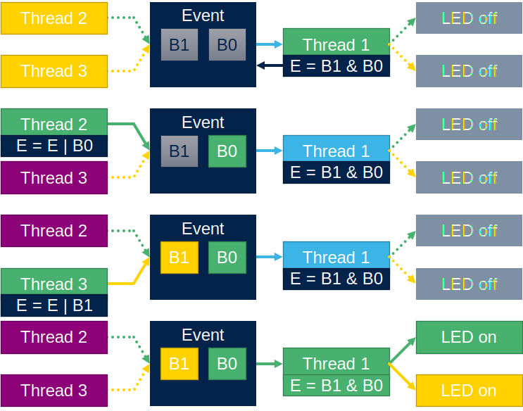
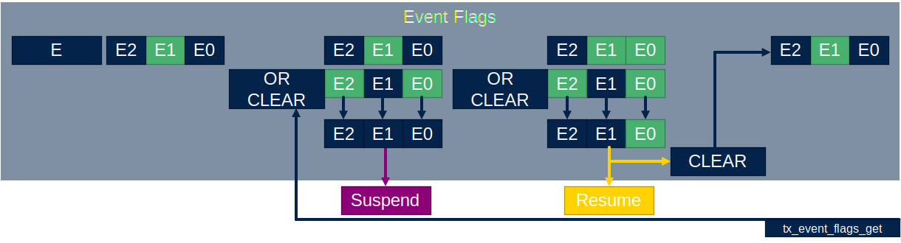

# Events flags

Events flags are very useful extention to semaphores and mutexes.
The event have 32bits. And thread can ask to watch specific bits by OR or AND. If this bits are set the thread is informed.
This can be used so synchronize multiple threads.



## Create event flags

Event flags are created by function `tx_event_flags_create`.

```c
/*Global variable*/
TX_EVENT_FLAGS_GROUP event_ptr;

/*In main*/
ret_val=tx_event_flags_create(&event_ptr, "my_event");
```

First argument is event flag handle `event_ptr`

```c
TX_EVENT_FLAGS_GROUP event_ptr;
```

Second argument is event name `my_event`

## Event flag set

The event flags are set by function `tx_event_flags_set`.
First argument is event flags handle.
Second argument are glags to set.
Third argument is way how flast will be set, `OR` or `AND`.
In this example the flag bit 1(10b) will `OR`ed with event flag content.

```c
VOID my_thread_entry2 (ULONG initial_input)
{
	while(1){
		tx_thread_sleep(50);
		tx_event_flags_set(&event_ptr, 0x2, TX_OR);
	}
}
```


AND is used mainly to clear event flags already set.

## Event flag get

For thread to check the flags is used function `tx_event_flags_get`.

```c
tx_event_flags_get(&event_ptr,0x3,TX_AND_CLEAR ,&events,TX_WAIT_FOREVER );
```

First argument is event flag handle `event_ptr`.
Second argument is flags wanted `0x3`(11b).
Third flag is way how to get the flags. `TX_AND`,`TX_OR`,`TX_OR_CLEAR`,`TX_AND_CLEAR`.
Forth argument is pointer flag result.
Fift argument is waiting time from `TX_NO_WAIT`(0x0) to `TX_WAIT_FOREVER`(0xFFFFFFFF).

### Event flag get with OR


### Event flag get with AND


### Event flag get with AND CLEAR


### Event flag get with OR CLEAR



## Example code

Two treas are settingf flags 0x1(01b) and 0x2(10b). Whe both flags are set the third thread will toggle with leds.


```c
/* USER CODE BEGIN PV */
#define THRAD_STACK_SIZE 1024
uint8_t thread_stack[THRAD_STACK_SIZE];
uint8_t thread_stack2[THRAD_STACK_SIZE];
uint8_t thread_stack3[THRAD_STACK_SIZE];
TX_THREAD thread_ptr;
TX_THREAD thread_ptr2;
TX_THREAD thread_ptr3;

TX_EVENT_FLAGS_GROUP event_ptr;
uint32_t ret_val;

/* USER CODE END PV */

/* Private function prototypes -----------------------------------------------*/
/* USER CODE BEGIN PFP */
VOID my_thread_entry (ULONG initial_input);
VOID my_thread_entry2 (ULONG initial_input);
VOID my_thread_entry3 (ULONG initial_input);
/* USER CODE END PFP */
/**
  * @brief  Application ThreadX Initialization.
  * @param memory_ptr: memory pointer
  * @retval int
  */
UINT App_ThreadX_Init(VOID *memory_ptr)
{
  UINT ret = TX_SUCCESS;
  TX_BYTE_POOL *byte_pool = (TX_BYTE_POOL*)memory_ptr;

  /* USER CODE BEGIN App_ThreadX_Init */
  ret_val = tx_thread_create(&thread_ptr, "my_thread",
      my_thread_entry, 0x1234,
	  thread_stack, THRAD_STACK_SIZE,
      14, 14, 1,
      TX_AUTO_START);
  ret_val = tx_thread_create(&thread_ptr2, "my_thread2",
      my_thread_entry2, 0x1234,
	  thread_stack2, THRAD_STACK_SIZE,
      15, 15, 1,
      TX_AUTO_START);
  ret_val = tx_thread_create(&thread_ptr3, "my_thread3",
      my_thread_entry3, 0x1234,
	  thread_stack3, THRAD_STACK_SIZE,
      15, 15, 1,
      TX_AUTO_START);

  ret_val=tx_event_flags_create(&event_ptr, "my_event");
  /* USER CODE END App_ThreadX_Init */

  return ret;
}
/* USER CODE BEGIN 1 */
VOID my_thread_entry (ULONG initial_input)
{
	while(1){
		uint32_t events;
		tx_event_flags_get(&event_ptr,0x3,TX_AND_CLEAR ,&events,TX_WAIT_FOREVER );
		HAL_GPIO_TogglePin(GPIOB, GPIO_PIN_0);
		HAL_GPIO_TogglePin(GPIOE, GPIO_PIN_1);
	}
}

VOID my_thread_entry2 (ULONG initial_input)
{
	while(1){
		tx_thread_sleep(50);
		tx_event_flags_set(&event_ptr, 0x2, TX_OR);
	}
}
VOID my_thread_entry3 (ULONG initial_input)
{
	while(1){
		tx_thread_sleep(100);
		tx_event_flags_set(&event_ptr, 0x1, TX_OR);
	}
}
```

## Event flag comparison with other ThreadX components


