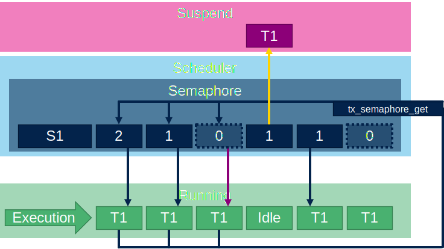

# Semaphore

The sempahore can be used to control if the thread can continue or not.
The semaphore have conter which is incremented by `tx_semaphore_put`. And decremented by `tx_semaphore_get`. When no semaphore is available the thread can be suspended until semaphore is available.

## Semaphore creation

For semaphore we must create a handle `TX_SEMAPHORE`.

```c
 TX_SEMAPHORE semaphore_ptr;
```

The semaphore is created by `tx_semaphore_create`
First argument is handle `semaphore_ptr`.
Second argument is name `my_semaphore`.
Third argument is initialization value for counter `1`.

```c
ret_val=tx_semaphore_create(&semaphore_ptr,"my_semaphore",1);
```

## Semaphore put

The thread can increase the semaphore conter value by calling `tx_semaphore_put`. It other threads are waiting on semaphore it will mowe them to ready state.


```c
VOID my_thread_entry (ULONG initial_input)
{
	while(1){
		HAL_GPIO_TogglePin(GPIOB, GPIO_PIN_0);
		tx_thread_sleep(1);
		tx_semaphore_put(&semaphore_ptr);

	}
}
```

## Semaphore get

If the application want semaphore it must call `tx_semaphore_get`. Second argument is waiting time. From to `TX_NO_WAIT`(0) `TX_WAIT_FOREVER`(0xFFFFFFFF).

```c
VOID my_thread_entry2 (ULONG initial_input)
{
	while(1){
		HAL_GPIO_TogglePin(GPIOE, GPIO_PIN_1);
		tx_semaphore_get(&semaphore_ptr,TX_WAIT_FOREVER);
		tx_thread_sleep(2);
	}
}
```


If the semaphore is not available(0) thead is put to suspend state until the semaphore is available or `tx_semaphore_get` reaches its timeout.



## Binary sempahore

The sempahore can be limited to maximum value inside its counter. For this is possible use `tx_semaphore_ceiling_put` with argument of maximum semaphore value.
This code will allow to interease semaphore only to value 1.

```c
tx_semaphore_ceiling_put(&semaphore_ptr,1);
```

And this code will allow to interease semaphore only to value 2.

```c
tx_semaphore_ceiling_put(&semaphore_ptr,2);
```

```c
VOID my_thread_entry (ULONG initial_input)
{
	while(1){
		HAL_GPIO_TogglePin(GPIOB, GPIO_PIN_0);
		tx_thread_sleep(1);
		tx_semaphore_ceiling_put(&semaphore_ptr,1);/*maximum semaphore value is 1*/

	}
}
```


## Example to test semaphore

```c
/* USER CODE BEGIN PV */
#define THRAD_STACK_SIZE 1024
uint8_t thread_stack[THRAD_STACK_SIZE];
uint8_t thread_stack2[THRAD_STACK_SIZE];
TX_THREAD thread_ptr;
TX_THREAD thread_ptr2;
TX_SEMAPHORE semaphore_ptr;
uint32_t ret_val;

/* USER CODE END PV */

/* Private function prototypes -----------------------------------------------*/
/* USER CODE BEGIN PFP */
VOID my_thread_entry (ULONG initial_input);
VOID my_thread_entry2 (ULONG initial_input);
/* USER CODE END PFP */
/**
  * @brief  Application ThreadX Initialization.
  * @param memory_ptr: memory pointer
  * @retval int
  */
UINT App_ThreadX_Init(VOID *memory_ptr)
{
  UINT ret = TX_SUCCESS;
  TX_BYTE_POOL *byte_pool = (TX_BYTE_POOL*)memory_ptr;

  /* USER CODE BEGIN App_ThreadX_Init */
  ret_val = tx_thread_create(&thread_ptr, "my_thread",
      my_thread_entry, 0x1234,
	  thread_stack, THRAD_STACK_SIZE,
      15, 15, 1,
      TX_AUTO_START);
  ret_val = tx_thread_create(&thread_ptr2, "my_thread2",
      my_thread_entry2, 0x1234,
	  thread_stack2, THRAD_STACK_SIZE,
      15, 15, 1,
      TX_AUTO_START);
  ret_val=tx_semaphore_create(&semaphore_ptr,"my_semaphore",1);
  /* USER CODE END App_ThreadX_Init */

  return ret;
}

/* USER CODE BEGIN 1 */


VOID my_thread_entry (ULONG initial_input)
{
	while(1){
		HAL_GPIO_TogglePin(GPIOB, GPIO_PIN_0);
		tx_thread_sleep(2);
		tx_semaphore_ceiling_put(&semaphore_ptr,1);//unconent test semaphore with limit
		//tx_semaphore_put(&semaphore_ptr,1);//unconent test semaphore without limit
	}
}

VOID my_thread_entry2 (ULONG initial_input)
{
	while(1){
		HAL_GPIO_TogglePin(GPIOE, GPIO_PIN_1);
		tx_semaphore_get(&semaphore_ptr,TX_WAIT_FOREVER);
		tx_thread_sleep(1);
	}
}

```
