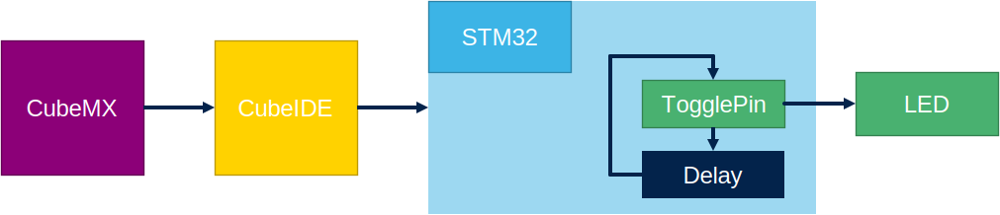
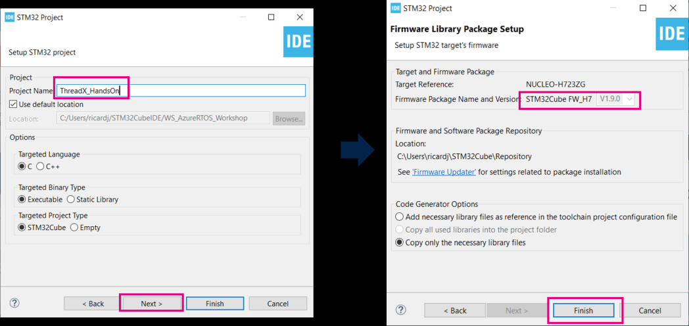
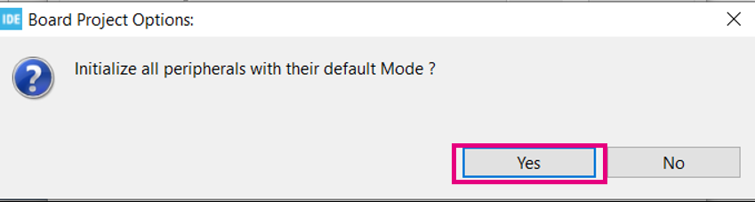
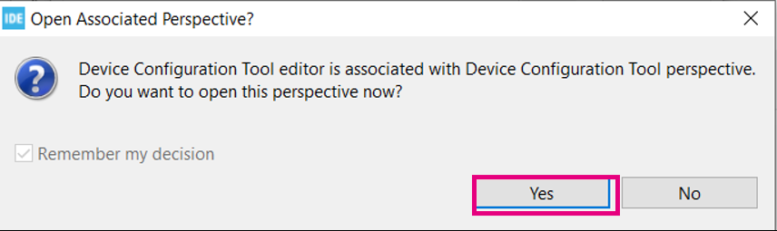
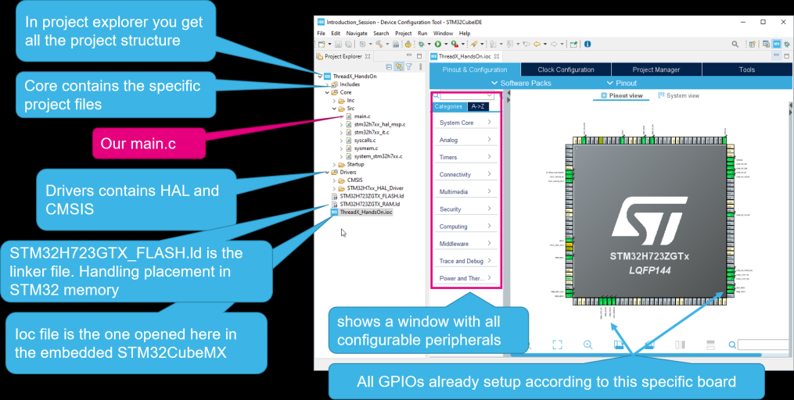
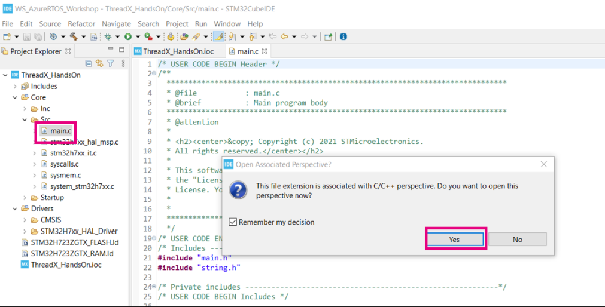
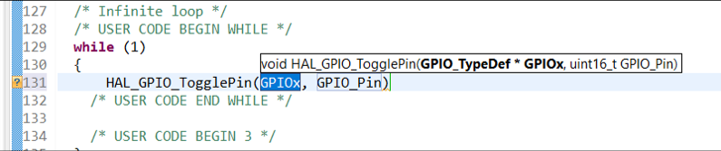
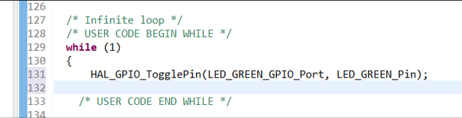
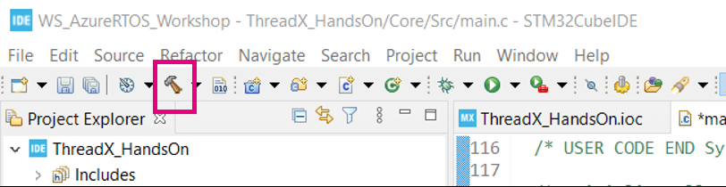
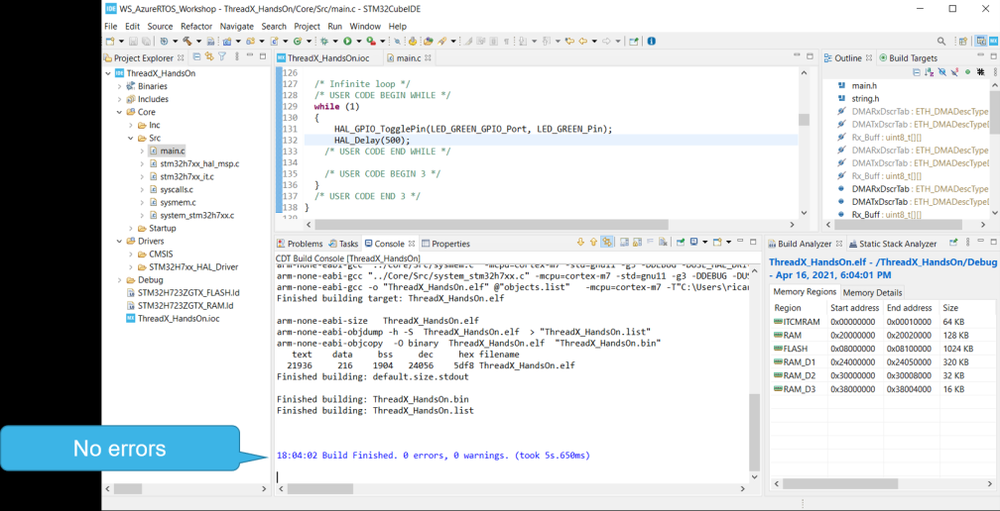

----!
Presentation
----!

# Start led blink from scratch

- This short hands-on will show you how to start a project from scratch
- The point is to a get first running led blink in few clicks
- We will then use this base to go further with ThreadX



# Launch STM32CubeIDE


# Select a workspace, click on Launch


# Start a new project

- Or use File>New>STM32Project (IDE)


# Board selector

- Click on board selector


# Look for Nucleo H723

1. Type H723 in the search box
2. Then click on Nucleo H723


# Select proposed board

1. Select proposed board
2. Click Next


# Project name

1. Type the project name
2. Next
3. Check FW version
4. Finish



# Finish the project setup

1. In pop-up asking of peripherals initialization
2. Click Yes



3. Then second popup to ask to open device configuration perspective.
4. Click Yes



# What you get after few clicks



# Edit main.c to add your code

1. Look for main.c and double click



2. Answer yes to the open perspective
3. Then go down to the main() function and find the while(1) loop line 129

```c
/* USER CODE BEGIN WHILE */
  while (1)
  {
    /* USER CODE END WHILE */

    /* USER CODE BEGIN 3 */
  }

```

# Adding LED toggling using code completion

1. Just before comment /_ USER CODE END WHILE _/ type:
2. HAL_GPIO_T and the CTRL-Space bar you should get:



3. First argument LED_GREEN_GPIO_Port (type LED CTRL+Space)
4. Second argument LED_GREEN_Pin
5. Add the final ‘;’


Or copy here:

```c
 HAL_GPIO_TogglePin(LED_GREEN_GPIO_Port, LED_GREEN_Pin);
```

# HAL GPIO Toggle

- Each time HAL_GPIO_TogglePin is called

  - LED will turn on/off

- Without delay impossible to see in run
  - Only in debug stepping


# Adding the delay between each LED toggle

1. Starting from



2. Type HAL_Delay
3. Choose a delay in ms : 500


```c
HAL_Delay(500);
```

4. Add final semicolon `;`
5. Now compile the project using the hammer



# Compilation result



# Connect the board to the computer

- Time to transfer firmware to the board
- First connect the Nucleo board to the computer


# Download firmware and Run on target

- First click on the project name
- Then menu Run/Run As/STM32 …
- In Edit Configuration window click OK


# LED is Blinking


