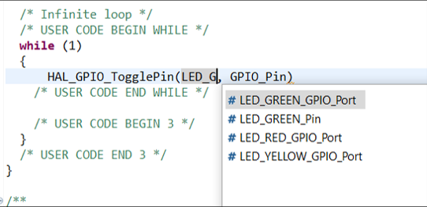

----!
Presentation
----!

# Adding GPIO Toggle



Or copy here:

```c
 HAL_GPIO_TogglePin(LED_GREEN_GPIO_Port, LED_GREEN_Pin);
```

# Creating first thread : variables declarations

1. Open Core\Src \app_threadx_rtos.c and add
2. To line 36 /* USER CODE BEGIN PD */ add:

```c
#define THRAD_STACK_SIZE 1024
```

3. To line 47 just after /* USER CODE BEGIN PV */ add:

```c
uint8_t thread_stack[THRAD_STACK_SIZE];
	TX_THREAD thread_ptr;
```

4. To line 52 after /* USER CODE BEGIN PFP */ add:

```c
VOID my_thread_entry(ULONG initial_input);
```

# STEP 2: Create the thread

```c
tx_thread_create( &thread_ptr, "my_thread", my_thread_entry, 0x1234, thread_stack, THRAD_STACK_SIZE, 15, 15, 1, TX_AUTO_START);
```

# STEP 3: Create the thread’s main function

1. At line 27, just after /* USER CODE BEGIN Includes */

```c
#include "main.h"
```

2. Then after line 77, /* USER CODE BEGIN 1 */
   
```c
VOID my_thread_entry (ULONG initial_input)
{
    while(1){
        HAL_GPIO_TogglePin(LED_GREEN_GPIO_Port, LED_GREEN_Pin);
        tx_thread_sleep(20);
    }
}
```

# Memory dedicated to trace

1. In app_threadx.c into section /* USER CODE BEGIN PV */ add

```c
#define TRACEX_BUFFER_SIZE 64000
uint8_t tracex_buffer[64000] __attribute__ ((section (".trace")));
```

2. To line 77 add:

```c
tx_trace_enable(&tracex_buffer,TRACEX_BUFFER_SIZE,30);
```

# Put trace buffer to AXI SRAM

1. Add this to STM32H723ZGTX_FLASH.ld file

```c
 .trace :
 {
  . = ALIGN(4);
     *(.trace)
 } > RAM_D1
```

# Change behaviour

1. In MainThread add the following lines:

```c
HAL_Delay(500);
```

# Add a second thread

1. To App_threadx.c add new thread handle and stack

```c
uint8_t thread_stack2[THRAD_STACK_SIZE];
TX_THREAD thread_ptr2;
```

2. Function prototype

```c
VOID my_thread_entry2(ULONG initial_input);
```

3. Create thread priority 14

```c
 tx_thread_create(&thread_ptr2, "my_thread2", my_thread_entry2, 0x1234, thread_stack2,	THRAD_STACK_SIZE, 14, 14, 1, TX_AUTO_START);
```

4. Thread function

```c
VOID my_thread_entry2 (ULONG initial_input)
{
    while(1){
        HAL_GPIO_TogglePin(LED_YELLOW_GPIO_Port, LED_YELLOW_Pin);
        HAL_Delay(200);
        tx_thread_sleep(20);
    }
}
```

# Activation of preemption threshold feature

1. Change my_thread preemption priority to 13

```c
      my_thread_entry, 0x1234, thread_stack, THRAD_STACK_SIZE, 15, 13, 1, TX_AUTO_START);
```